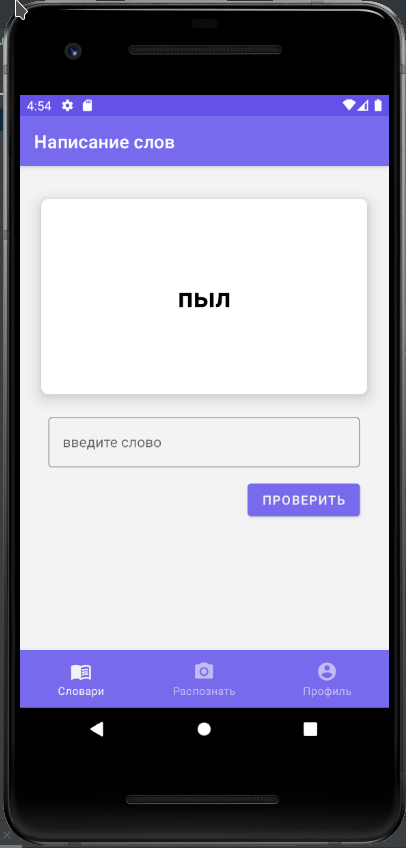
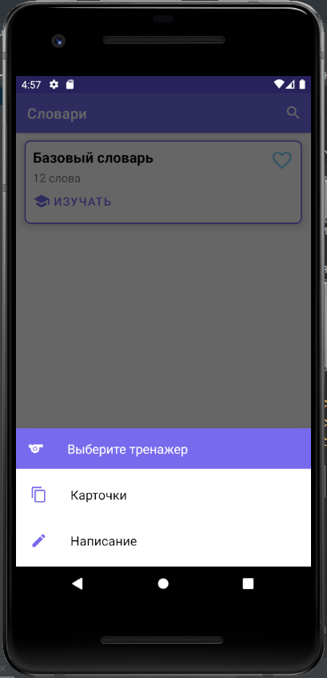
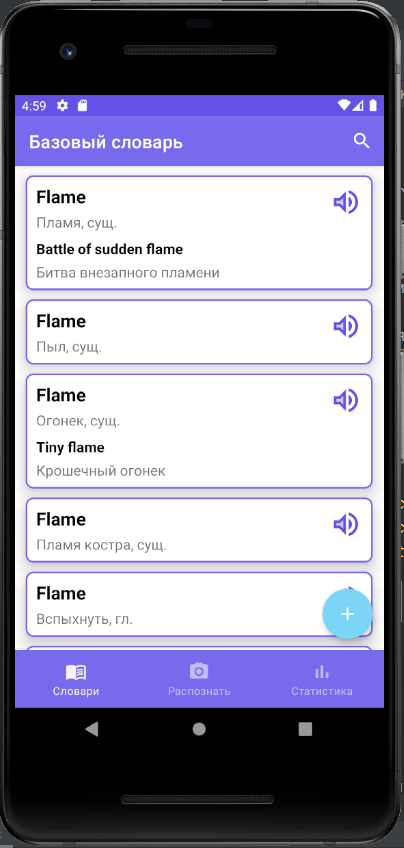
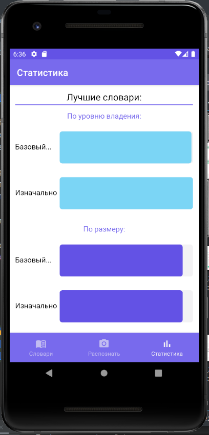

# Kotelok

The application is designed for learning foreign languages. It includes a dictionary,
exercises for learning added words, many different ways to add new words,
user statistics and the user's achievements.

Приложение предназначено для изучения иностранных языков. Оно включает в себя словарь, 
упражнения для изучения добавленных слов, множеством различных способов добавления новых слов, 
статистику пользователя и достижения пользователя.

Для получения информации о словах используется сервис [«API «Яндекс.Словарь»](http://api.yandex.ru/dictionary).

To build the project locally, set `yandex_api_key` in the file `/Kotelok/local.properties` 
## Команда авторов

- [Андрей Гуденков](https://github.com/andreyhoco)
- [Мария Черепнина](https://github.com/MariaMsu)
- [Александра Первушина](https://github.com/queenofpigeons)

